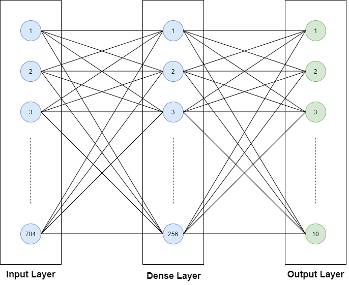
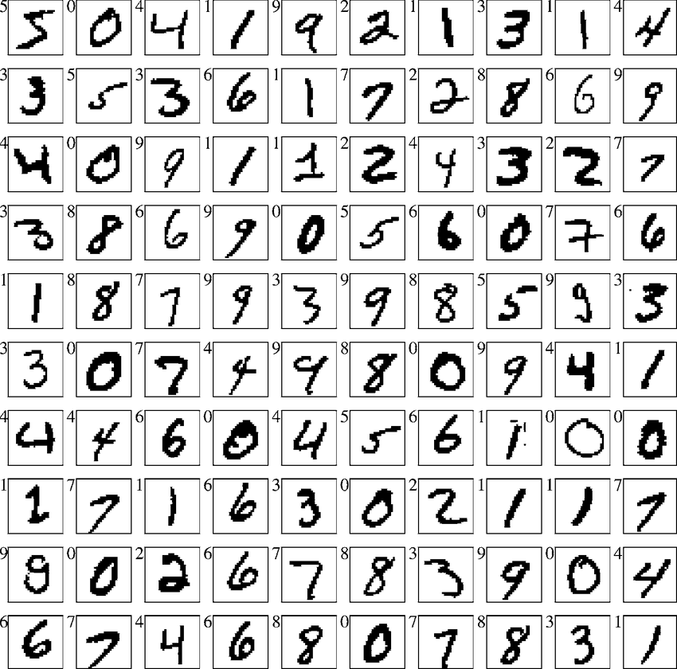
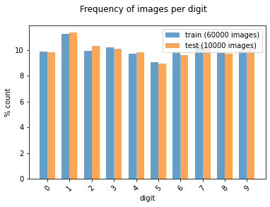
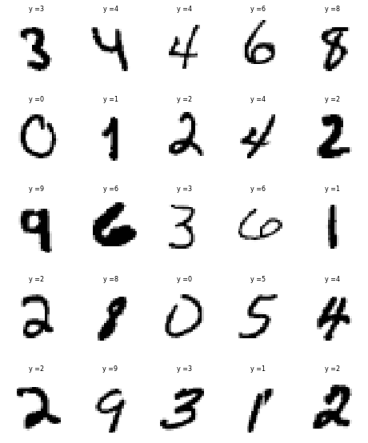
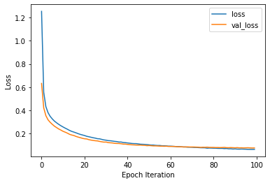
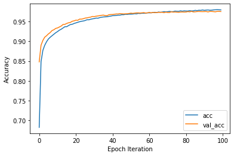
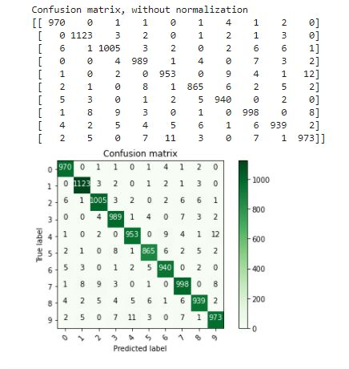
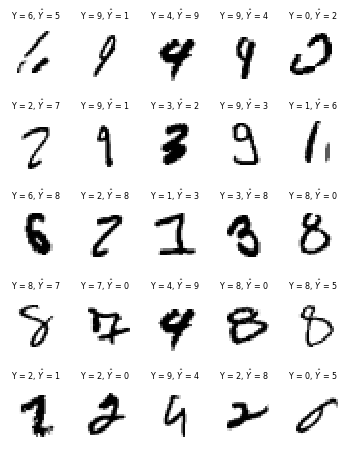

# MNIST Hand-Written Digits Classification using Artificial Neural Networks (ANN) in Python

## 1. Objective

The objective of this project is to develop an Artificial Neural Network (ANN) to classify hand-written digits using the widely used MNIST data set.

## 2. Motivation

The MNIST handwritten digit classification problem is a standard dataset used in computer vision and deep learning.

Although the dataset is effectively solved, it can be used as the basis for learning and practicing how to develop, evaluate, and use simple artificial neural networks for image classification from scratch. 

In this section, we shall demonstrate how to develop a simple artificial neural network for handwritten digit classification from scratch, including:

* How to prepare the input training and test data 
* How to deploy the model
* How to use the trained model to make predictions
* How to evaluate its performance

## 3. Data

The MNIST database of handwritten digits, is widely used for training and evaluating various supervised machine and deep learning models [1]:

* It has a training set of 60,000 examples
* It has test set of 10,000 examples
* It is a subset of a larger set available from NIST. 
* The digits have been size-normalized and centered in a fixed-size image.
* It is a good database for people who want to try learning techniques and pattern recognition methods on real-world data while spending minimal efforts on preprocessing and formatting.
* The original black and white images from NIST were size normalized and resized to 28x28 binary images.

Sample images from the MNIST data set are illustrated next:
* There are significant variations how digits are handwritten by different people
* The same digit may be written quite differently by different people
* More significantly, different handwritten digits may appear similar, such as the 0, 5 and 6 or the 7 and 9.

## 4. Development

In this section, we shall demonstrate how to develop a simple artificial neural network for handwritten digit classification from scratch, including:

* How to prepare the input training and test data 
* How to deploy the model
* How to use the trained model to make predictions
* How to evaluate its performance

* Author: Mohsen Ghazel (mghazel)
* Date: April 5th, 2021

* Project: MNIST Handwritten Digits Classification using Artificial Neural Networks (ANN):

The objective of this project is to demonstrate how to develop a simple artificial neural network to classify images of hand-written digits, from 0-9:

We shall apply the standard Machine and Deep Learning model development and evaluation process, with the following steps:

* Load the MNIST dataset of handwritten digits:
* 60,000 labelled training examples
* 10,000 labelled test examples
* Each handwritten example is 28x28 pixels binary image.

Build a simple ANN model
Train the selected ML model
Deploy the trained on the test data
Evaluate the performance of the trained model using evaluation metrics:
Accuracy
Confusion Matrix
Other metrics derived form the confusion matrix.

### 4.1. Part 1: Imports and global variables
#### 4.1.1. Standard scientific Python imports:

<pre style="color:#000000;background:#e6ffff;font-size:10px;line-height:1.5;"># numpy
import numpy as np
# matplotlib
import matplotlib.pyplot as plt
# opencv
import cv2
# tensorflow
import tensorflow as tf
# random number generators values
# seed for reproducing the random number generation
from random import seed
# random integers: I(0,M)
from random import randint
# random standard unform: U(0,1)
from random import random
# time
import datetime
# I/O
import os
# sys
import sys

# check for successful package imports and versions
# python
print("Python version : {0} ".format(sys.version))
# OpenCV
print("OpenCV version : {0} ".format(cv2.__version__))
# numpy
print("Numpy version  : {0}".format(np.__version__))
# tensorflow
print("Tensorflow version  : {0}".format(tf.__version__))

Python version : 3.7.10 (default, Feb 20 2021, 21:17:23) 
[GCC 7.5.0] 
OpenCV version : 4.1.2 
Numpy version  : 1.19.5
Tensorflow version  : 2.4.1
</pre>

#### 4.1.2. Global variables

<pre style="color:#000000;background:#e6ffff;font-size:10px;line-height:1.5;"># -set the random_state seed = 101 for reproducibilty
random_state_seed = 101

# the number of visualized images
num_visualized_images = 25
</pre>

### 4.2. Load MNIST Dataset

#### 4.2.1 Load the MNIST dataset

* Load the MNIST dataset of handwritten digits:
* 60,000 labelled training examples
* 10,000 labelled test examples
* Each handwritten example is 28x28 pixels binary image.

<pre style="color:#000000;background:#e6ffff;font-size:10px;line-height:1.5;"># Load in the data: MNIST
mnist = tf.keras.datasets.mnist
# mnist.load_data() automatically splits traing and test data sets
(x_train, y_train), (x_test, y_test) = mnist.load_data()
</pre>

### 4.2. Explore training and test images:

#### 4.2.1. Display the number and shape of the training and test subsets:

<pre style="color:#000000;background:#e6ffff;font-size:10px;line-height:1.5;">#------------------------------------------------------
# Training data:
#------------------------------------------------------
# the number of training images
num_train_images = x_train.shape[0]
print("----------------------------------------------")
print("Training data:")
print("----------------------------------------------")
print("x_train.shape: ", x_train.shape)
print("Number of training images: ", num_train_images)
print("Image size: ", x_train.shape[1:])

#------------------------------------------------------
# Test data:
#------------------------------------------------------
# the number of test images
num_test_images = x_test.shape[0]
print("----------------------------------------------")
print("Test data:")
print("----------------------------------------------")
print("x_test.shape: ", x_test.shape)
print("Number of test images: ", num_test_images)
print("Image size: ", x_test.shape[1:])
print("----------------------------------------------")

#------------------------------------------------------
# Training data:
#------------------------------------------------------
# the number of training images
num_train_images = x_train.shape[0]
print("----------------------------------------------")
print("Training data:")
print("----------------------------------------------")
print("x_train.shape: ", x_train.shape)
print("Number of training images: ", num_train_images)
print("Image size: ", x_train.shape[1:])

#------------------------------------------------------
# Test data:
#------------------------------------------------------
# the number of test images
num_test_images = x_test.shape[0]
print("----------------------------------------------")
print("Test data:")
print("----------------------------------------------")
print("x_test.shape: ", x_test.shape)
print("Number of test images: ", num_test_images)
print("Image size: ", x_test.shape[1:])
print("----------------------------------------------")
</pre>

#### 4.2.2. Display the targets/classes:

* The classification of the digits should be: 0 to 9:

<pre style="color:#000000;background:#e6ffff;font-size:10px;line-height:1.5;">print("----------------------------------------------")
print("Classes/labels:")
print("----------------------------------------------")
print('The target labels: ' + str(np.unique(y_train)))
print("----------------------------------------------")

----------------------------------------------
Classes/labels:
----------------------------------------------
The target labels: [0 1 2 3 4 5 6 7 8 9]
----------------------------------------------
</pre>

#### 4.2.3. Examine the number of images for each class of the training and testing subsets:

<pre style="color:#000000;background:#e6ffff;font-size:10px;line-height:1.5;"># Create a histogram of the number of images in each class/digit:
def plot_bar(y, loc='left', relative=True):
    width = 0.35
    if loc == 'left':
        n = -0.5
    elif loc == 'right':
        n = 0.5
     
    # calculate counts per type and sort, to ensure their order
    unique, counts = np.unique(y, return_counts=True)
    sorted_index = np.argsort(unique)
    unique = unique[sorted_index]
     
    if relative:
        # plot as a percentage
        counts = 100*counts[sorted_index]/len(y)
        ylabel_text = '% count'
    else:
        # plot counts
        counts = counts[sorted_index]
        ylabel_text = 'count'
         
    xtemp = np.arange(len(unique))
    plt.bar(xtemp + n*width, counts, align='center', alpha=.7, width=width)
    plt.xticks(xtemp, unique, rotation=45)
    plt.xlabel('digit')
    plt.ylabel(ylabel_text)
 
plt.suptitle('Frequency of images per digit')
plot_bar(y_train, loc='left')
plot_bar(y_test, loc='right')
plt.legend([
    'train ({0} images)'.format(len(y_train)), 
    'test ({0} images)'.format(len(y_test)), 
]);
</pre>

#### 4.2.4. Visualize some of the training and test images and their associated targets:

* First implement a visualization functionality to visualize the number of randomly selected images:

<pre style="color:#000000;background:#e6ffff;font-size:10px;line-height:1.5;">"""
# A utility function to visualize multiple images:
"""
def visualize_images_and_labels(num_visualized_images = 25, dataset_flag = 1):
  """To visualize images.

&nbsp;&nbsp;&nbsp;&nbsp;&nbsp;&nbsp;Keyword arguments:
&nbsp;&nbsp;&nbsp;&nbsp;&nbsp;&nbsp;&nbsp;&nbsp;&nbsp;- num_visualized_images -- the number of visualized images (deafult 25)
&nbsp;&nbsp;&nbsp;&nbsp;&nbsp;&nbsp;&nbsp;&nbsp;&nbsp;- dataset_flag -- 1: training dataset, 2: test dataset
&nbsp;&nbsp;&nbsp;&nbsp;&nbsp;&nbsp;Return:
&nbsp;&nbsp;&nbsp;&nbsp;&nbsp;&nbsp;&nbsp;&nbsp;&nbsp;- None
&nbsp;&nbsp;"""
  #--------------------------------------------
  # the suplot grid shape:
  #--------------------------------------------
  num_rows = 5
  # the number of columns
  num_cols = num_visualized_images // num_rows
  # setup the subplots axes
  fig, axes = plt.subplots(nrows=num_rows, ncols=num_cols, figsize=(8, 10))
  # set a seed random number generator for reproducible results
  seed(random_state_seed)
  # iterate over the sub-plots
  for row in range(num_rows):
      for col in range(num_cols):
        # get the next figure axis
        ax = axes[row, col];
        # turn-off subplot axis
        ax.set_axis_off()
        #--------------------------------------------
        # if the dataset_flag = 1: Training data set
        #--------------------------------------------
        if ( dataset_flag == 1 ): 
          # generate a random image counter
          counter = randint(0,num_train_images)
          # get the training image
          image = x_train[counter,:]
          # get the target associated with the image
          label = y_train[counter]
        #--------------------------------------------
        # dataset_flag = 2: Test data set
        #--------------------------------------------
        else: 
          # generate a random image counter
          counter = randint(0,num_test_images)
          # get the test image
          image = x_test[counter,:]
          # get the target associated with the image
          label = y_test[counter]
        #--------------------------------------------
        # display the image
        #--------------------------------------------
        ax.imshow(image, cmap=plt.cm.gray_r, interpolation='nearest')
        # set the title showing the image label
        ax.set_title('y =' + str(label), size = 8)
</pre>

##### 4.2.4.1. Visualize some of the training images and their associated targets:

### 4.2.5) Normalize the training and test images to the interval: [0, 1]:

<pre style="color:#000000;background:#e6ffff;font-size:10px;line-height:1.5;"># Normalize the training images
x_train = x_train / 255.0
# Normalize the test images
x_test = x_test / 255.0
</pre>

### 4.3. Part 3: Develop the ANN model architecture

Develop the structure of the ANN model to classify the MINIST images:

<pre style="color:#000000;background:#e6ffff;font-size:10px;line-height:1.5;"># Build the model
model = tf.keras.models.Sequential([
  #-----------------------------------------------------------------------------
  # Input layer: 
  #-----------------------------------------------------------------------------
  # - Input images size: (28,28) grayscale images
  tf.keras.layers.Flatten(input_shape=(28, 28)), 
  #-----------------------------------------------------------------------------
  # Layer # 1: 
  #-----------------------------------------------------------------------------
  # - 128 neurons
  # -  relu activation function 
  #-----------------------------------------------------------------------------
  tf.keras.layers.Dense(128, activation='relu'), 
  #-----------------------------------------------------------------------------
  # Layer # 2: 
  #-----------------------------------------------------------------------------
  # Dropout layer wit: p = 0.2
  tf.keras.layers.Dropout(0.2), 
  #-----------------------------------------------------------------------------
  # Output layer: 
  #-----------------------------------------------------------------------------
  #  - 10 classes (0 - 9)
  #  - activation function for multi-class classification: softwax
  #-----------------------------------------------------------------------------
  tf.keras.layers.Dense(10, activation='softmax') 
])
</pre>

<pre style="color:#000000;background:#e6ffff;font-size:10px;line-height:1.5;"># Print the model summary
model.summary()

Model: "sequential"
_________________________________________________________________
Layer (type)                 Output Shape              Param #   
=================================================================
flatten (Flatten)            (None, 784)               0         
_________________________________________________________________
dense (Dense)                (None, 128)               100480    
_________________________________________________________________
dropout (Dropout)            (None, 128)               0         
_________________________________________________________________
dense_1 (Dense)              (None, 10)                1290      
=================================================================
Total params: 101,770
Trainable params: 101,770
Non-trainable params: 0
</pre>

### 4.4. Part 4: Compile the ANN model

* Compile the ANN model, developed above:

<pre style="color:#000000;background:#e6ffff;font-size:10px;line-height:1.5;"># Compile the ANN model
model.compile(optimizer='adam', # the optimizer: Gradient descent version (adam vs. SGD, etc.)
              loss='sparse_categorical_crossentropy', # use for multi-class classification models
              metrics=['accuracy']) # performance evaluation metric
</pre>

### 4.5. Part 5: Train/Fit the model

* Start training the compiled ANN model:

<pre style="color:#000000;background:#e6ffff;font-size:10px;line-height:1.5;"># Train the model
# - Train for 100 epochs:
r = model.fit(x_train, y_train, validation_data=(x_test, y_test), epochs=100)
</pre>

<pre style="color:#000000;background:#e6ffff;font-size:10px;line-height:1.5;">Epoch 1/100
1875/1875 [===] - 4s 2ms/step - loss: 1.7302 - accuracy: 0.5456 - val_loss: 0.6326 - val_accuracy: 0.8480
Epoch 2/100
1875/1875 [===] - 3s 2ms/step - loss: 0.6060 - accuracy: 0.8383 - val_loss: 0.4226 - val_accuracy: 0.8902
Epoch 3/100
1875/1875 [===] - 3s 2ms/step - loss: 0.4503 - accuracy: 0.8726 - val_loss: 0.3552 - val_accuracy: 0.9023
Epoch 4/100
1875/1875 [===] - 3s 2ms/step - loss: 0.3936 - accuracy: 0.8865 - val_loss: 0.3196 - val_accuracy: 0.9105
Epoch 5/100
1875/1875 [===] - 3s 2ms/step - loss: 0.3599 - accuracy: 0.8956 - val_loss: 0.2979 - val_accuracy: 0.9142
.........................................................................................................
.........................................................................................................
Epoch 95/100
1875/1875 [===] - 3s 2ms/step - loss: 0.0634 - accuracy: 0.9796 - val_loss: 0.0772 - val_accuracy: 0.9757
Epoch 96/100
1875/1875 [===] - 3s 2ms/step - loss: 0.0675 - accuracy: 0.9798 - val_loss: 0.0782 - val_accuracy: 0.9753
Epoch 97/100
1875/1875 [===] - 3s 2ms/step - loss: 0.0657 - accuracy: 0.9794 - val_loss: 0.0788 - val_accuracy: 0.9748
Epoch 98/100
1875/1875 [===] - 3s 2ms/step - loss: 0.0642 - accuracy: 0.9803 - val_loss: 0.0776 - val_accuracy: 0.9759
Epoch 99/100
1875/1875 [===] - 4s 2ms/step - loss: 0.0657 - accuracy: 0.9791 - val_loss: 0.0768 - val_accuracy: 0.9759
Epoch 100/100
1875/1875 [===] - 3s 2ms/step - loss: 0.0650 - accuracy: 0.9792 - val_loss: 0.0772 - val_accuracy: 0.9755
</pre>

### 4.6. Part 6: Evaluate the model

* Evaluate the trained ANN model on the test data using different evaluation metrics:
  * Loss function
  * Accuracy
  * Confusion matrix.

#### 4.6.1. Loss function:

* Display the variations of the training and validation loss function with the number of epochs:

<pre style="color:#000000;background:#e6ffff;font-size:10px;line-height:1.5;"># Plot loss per iteration
import matplotlib.pyplot as plt
plt.plot(r.history['loss'], label='loss')
plt.plot(r.history['val_loss'], label='val_loss');
plt.legend();
plt.xlabel('Epoch Iteration');
plt.ylabel('Loss');
</pre>

#### 4.6.2. Accuracy:

* Display the variations of the training and validation accuracy with the number of epochs:

<pre style="color:#000000;background:#e6ffff;font-size:10px;line-height:1.5;"># Plot accuracy per iteration
plt.plot(r.history['accuracy'], label='acc');
plt.plot(r.history['val_accuracy'], label='val_acc');
plt.legend();
plt.xlabel('Epoch Iteration');
plt.ylabel('Accuracy');
</pre>

<pre style="color:#000000;background:#e6ffff;font-size:10px;line-height:1.5;"># Compute the model accuracy on the test data
print(model.evaluate(x_test, y_test))

313/313 [==============================] - 0s 1ms/step - loss: 0.0772 - accuracy: 0.9755
[0.07720769196748734, 0.9754999876022339]
</pre>

#### 4.6.3. Confusion Matrix Visualizations:

* Compute the confusion matrix:

<pre style="color:#000000;background:#e6ffff;font-size:10px;line-height:1.5;">#-------------------------------------------------------------------------------
# Compute the confusion matrix
#-------------------------------------------------------------------------------
def plot_confusion_matrix(cm, classes,
                          normalize=False,
                          title='Confusion matrix',
                          cmap=plt.cm.Blues):
  """
&nbsp;&nbsp;This function prints and plots the confusion matrix.
&nbsp;&nbsp;Normalization can be applied by setting `normalize=True`.
&nbsp;&nbsp;"""
  if normalize:
      cm = cm.astype('float') / cm.sum(axis=1)[:, np.newaxis]
      print("Normalized confusion matrix")
  else:
      print('Confusion matrix, without normalization')

  # Display the confusuon matrix
  print(cm)
  # display the confusion matrix
  plt.imshow(cm, interpolation='nearest', cmap=cmap)
  plt.title(title)
  plt.colorbar()
  tick_marks = np.arange(len(classes))
  plt.xticks(tick_marks, classes, rotation=45)
  plt.yticks(tick_marks, classes)
  
  fmt = '.2f' if normalize else 'd'
  thresh = cm.max() / 2.
  for i, j in itertools.product(range(cm.shape[0]), range(cm.shape[1])):
      plt.text(j, i, format(cm[i, j], fmt),
               horizontalalignment="center",
               color="white" if cm[i, j] &gt; thresh else "black")

  plt.tight_layout()
  plt.ylabel('True label')
  plt.xlabel('Predicted label')
  plt.show()

#-------------------------------------------------------------------------------
# Predict the targets for the test data
#-------------------------------------------------------------------------------
p_test = model.predict(x_test).argmax(axis=1)
# construct the confusion matrix
cm = confusion_matrix(y_test, p_test)
# plot the confusion matrix
plot_confusion_matrix(cm, list(range(10)), False, 'Confusion matrix', plt.cm.Greens)
</pre>

### 4.6.4. Examine some of the misclassified digits:

* Display some of the misclassified digits:

<pre style="color:#000000;background:#e6ffff;font-size:10px;line-height:1.5;"># - Find the indices of all the mis-classified examples
misclassified_idx = np.where(p_test != y_test)[0] # select the index
# setup the subplot grid for the visualized images
 # the suplot grid shape
num_rows = 5
# the number of columns
num_cols = num_visualized_images // num_rows
# setup the subplots axes
fig, axes = plt.subplots(nrows=num_rows, ncols=num_cols, figsize=(6, 8))
# set a seed random number generator for reproducible results
seed(random_state_seed)
# iterate over the sub-plots
for row in range(num_rows):
  for col in range(num_cols):
    # get the next figure axis
    ax = axes[row, col];
    # turn-off subplot axis
    ax.set_axis_off()
    # select a random mis-classified example
    counter = np.random.choice(misclassified_idx)
    # get test image 
    image = x_test[counter,:]
    # get the true labels of the selected image
    label = y_test[counter]
    # get the predicted label of the test image
    yhat = p_test[counter]
    # display the image 
    ax.imshow(image, cmap=plt.cm.gray_r, interpolation='nearest')
    # display the true and predicted labels on the title of teh image
    ax.set_title('Y = %i, $\hat{Y}$ = %i' % (int(label), int(yhat)), size = 8)
</pre>

### 4.7. Part 7: Display a final message after successful execution completion:

<pre style="color:#000000;background:#e6ffff;font-size:10px;line-height:1.5;"># display a final message
# current time
now = datetime.datetime.now()
# display a message
print('Program executed successfully on: '+ str(now.strftime("%Y-%m-%d %H:%M:%S") + "...Goodbye!\n"))

Program executed successfully on: 2021-04-05 19:42:07...Goodbye!
</pre>

## 5. Analysis

In view of the presented results, we make the following observations:

* The simple designed ANN achieves a surprisingly high accuracy of the MNIST data classification.
* The few misclassifications appear reasonable:
* It is reasonable to confuse 9 with 4, 9, 
* It is reasonable to confuse 9 with 7,
* It is reasonable to confuse 2 with 7, etc. 

## 6. Future Work

We plan to explore the following related issues:

* To explore ways of improving the performance of this simple ANN, including fine-tuning the following hyper-parameters:
* The number of neurons
* The dropout rate
* The optimizer
* The learning rate.

## 7. References

1. Yun Lecun, Corina Cortes, Christopher J.C. Buges. The MNIST database if handwritten digits. Retrieved from: http://yann.lecun.com/exdb/mnist/.
2. Prateek Goyal. MNIST dataset using Dee Leaning algorithm (ANN). Retrieved from: https://medium.com/@prtk13061992/mnist-dataset-using-deep-learning-algorithm-ann-c6f83aa594f5.
3. Tyler Elliot Bettilyon. How to classify MNIST digits with different neural network architectures. Retrieved from: https://medium.com/tebs-lab/how-to-classify-mnist-digits-with-different-neural-network-architectures-39c75a0f03e3.
4. Mönchmeyer Anracon. A simple Python program for an ANN to cover the MNIST dataset: A starting point. Retrieved from: https://linux-blog.anracom.com/2019/09/29/a-simple-program-for-an-ann-to-cover-the-mnist-dataset-i/.
5. Orhan G. Yalcin. Image Classification in 10 Minutes with MNIST Dataset Using Convolutional Neural Networks to Classify Handwritten Digits with TensorFlow and Keras | Supervised Deep Learning. Retrieved from: https://towardsdatascience.com/image-classification-in-10-minutes-with-mnist-dataset-54c35b77a38d.

:

